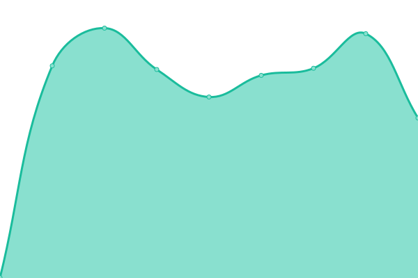
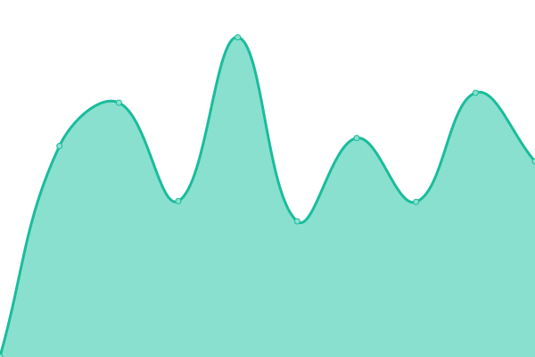
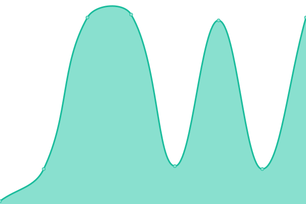

# [📈 Live Status](https://demo.upptime.js.org): <!--live status--> **🟩 All systems operational**

This repository contains the open-source uptime monitor and status page for [Upptime](https://upptime.js.org), powered by [Upptime](https://github.com/upptime/upptime).

With [Upptime](https://upptime.js.org), you can get your own unlimited and free uptime monitor and status page, powered entirely by a GitHub repository. We use [Issues](https://github.com/upptime/upptime/issues) as incident reports, [Actions](https://github.com/shawngao-org/status/actions) as uptime monitors, and [Pages](https://demo.upptime.js.org) for the status page.

<!--start: status pages-->
<!-- This summary is generated by Upptime (https://github.com/upptime/upptime) -->
<!-- Do not edit this manually, your changes will be overwritten -->
<!-- prettier-ignore -->
| URL | Status | History | Response Time | Uptime |
| --- | ------ | ------- | ------------- | ------ |
|  [Blog](https://www.sgtu.org/) | 🟩 Up | [blog.yml](https://github.com/shawngao-org/status/commits/HEAD/history/blog.yml) | 

 874ms
     
 | 

<a href="https://s.sgtu.org/history/blog">53.68%</a>
    

|  [File share](https://file.sgtu.org/) | 🟩 Up | [file-share.yml](https://github.com/shawngao-org/status/commits/HEAD/history/file-share.yml) | 

 1325ms
     
 | 

<a href="https://s.sgtu.org/history/file-share">99.80%</a>
    

|  [Dev tools](https://tool.sgtu.org/) | 🟩 Up | [dev-tools.yml](https://github.com/shawngao-org/status/commits/HEAD/history/dev-tools.yml) | 

 572ms
     
 | 

<a href="https://s.sgtu.org/history/dev-tools">53.68%</a>
    

|  [Minecraft Skin](https://skin.sgtu.ltd/) | 🟩 Up | [minecraft-skin.yml](https://github.com/shawngao-org/status/commits/HEAD/history/minecraft-skin.yml) | 

 903ms
     
 | 

<a href="https://s.sgtu.org/history/minecraft-skin">100.00%</a>
    

|  [Nexus](https://nexus.sgtu.org/) | 🟩 Up | [nexus.yml](https://github.com/shawngao-org/status/commits/HEAD/history/nexus.yml) | 

 502ms
     
 | 

<a href="https://s.sgtu.org/history/nexus">100.00%</a>
    

|  [Gravatar proxy](https://gravatar.shawngao.org/) | 🟩 Up | [gravatar-proxy.yml](https://github.com/shawngao-org/status/commits/HEAD/history/gravatar-proxy.yml) | 

 1812ms
     
 | 

<a href="https://s.sgtu.org/history/gravatar-proxy">100.00%</a>
    

|  [GitLab](https://git.sgtu.org/) | 🟩 Up | [git-lab.yml](https://github.com/shawngao-org/status/commits/HEAD/history/git-lab.yml) | 

 739ms
     
 | 

<a href="https://s.sgtu.org/history/git-lab">53.68%</a>
    

|  Fast Reverse Proxy | 🟩 Up | [fast-reverse-proxy.yml](https://github.com/shawngao-org/status/commits/HEAD/history/fast-reverse-proxy.yml) | 

 1090ms
     
 | 

<a href="https://s.sgtu.org/history/fast-reverse-proxy">100.00%</a>
    

|  SonarQube | 🟩 Up | [sonar-qube.yml](https://github.com/shawngao-org/status/commits/HEAD/history/sonar-qube.yml) | 

 627ms
     
 | 

<a href="https://s.sgtu.org/history/sonar-qube">100.00%</a>
    

|  DE-BGP-6C24G-1000M | 🟩 Up | [de-bgp-6-c24-g-1000-m.yml](https://github.com/shawngao-org/status/commits/HEAD/history/de-bgp-6-c24-g-1000-m.yml) | 

 108ms
     
 | 

<a href="https://s.sgtu.org/history/de-bgp-6-c24-g-1000-m">100.00%</a>
    

|  US-BGP-2C6G-50M | 🟩 Up | [us-bgp-2-c6-g-50-m.yml](https://github.com/shawngao-org/status/commits/HEAD/history/us-bgp-2-c6-g-50-m.yml) | 

 63ms
     
 | 

<a href="https://s.sgtu.org/history/us-bgp-2-c6-g-50-m">100.00%</a>
    

|  CN-BGP-4C4G-10M | 🟩 Up | [cn-bgp-4-c4-g-10-m.yml](https://github.com/shawngao-org/status/commits/HEAD/history/cn-bgp-4-c4-g-10-m.yml) | 

 242ms
     
 | 

<a href="https://s.sgtu.org/history/cn-bgp-4-c4-g-10-m">99.58%</a>
    

|  CN-CT-2C4G-500M | 🟩 Up | [cn-ct-2-c4-g-500-m.yml](https://github.com/shawngao-org/status/commits/HEAD/history/cn-ct-2-c4-g-500-m.yml) | 

 230ms
     
 | 

<a href="https://s.sgtu.org/history/cn-ct-2-c4-g-500-m">100.00%</a>
    

<!--end: status pages-->

[**Visit our status website →**](https://s.sgtu.org)

## 📄 License

- Powered by: [Upptime](https://github.com/upptime/upptime)
- Code: [MIT](./LICENSE) © [Anand Chowdhary](https://anandchowdhary.com), supported by [Pabio](https://pabio.com)
- Data in the `./history` directory: [Open Database License](https://opendatacommons.org/licenses/odbl/1-0/)
